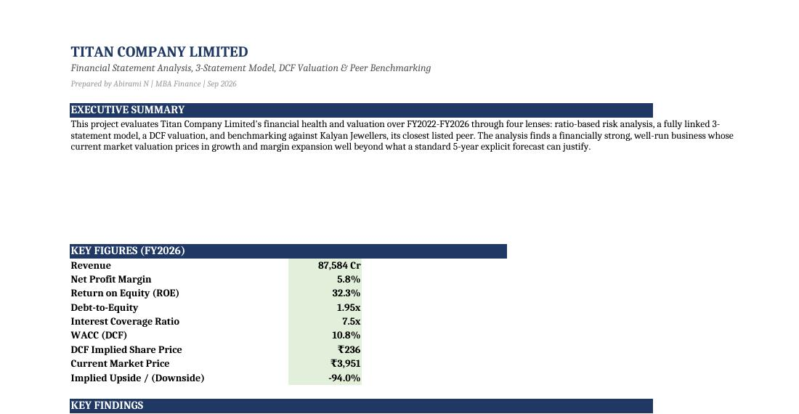
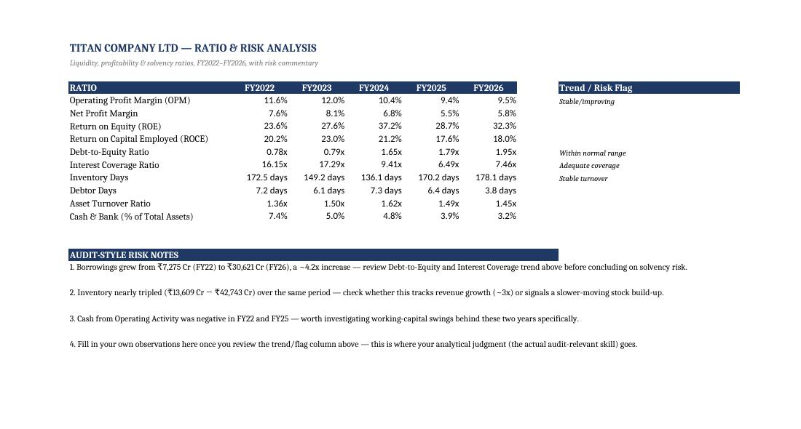
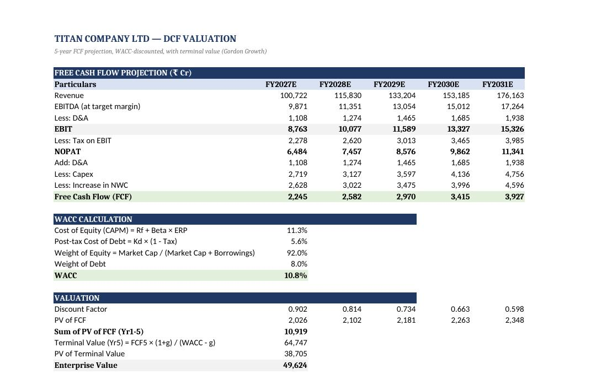
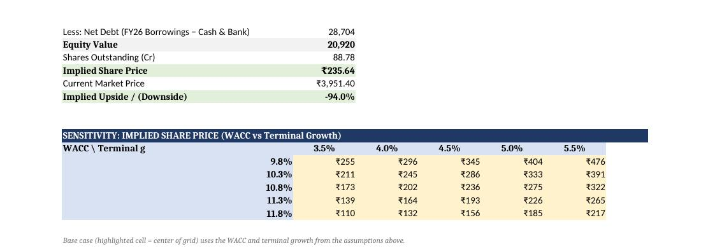
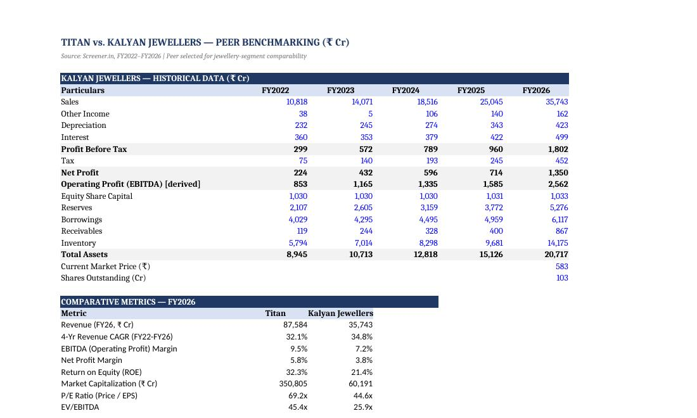

# 📈 Financial Statement Analysis, 3-Statement Model & Valuation — Titan Company Ltd

## 📊 Project Overview
This project analyzes Titan Company Limited's financial performance over 5 years (FY2022-FY2026) through ratio analysis, a fully integrated 3-statement financial model, and a DCF valuation benchmarked against Kalyan Jewellers, its closest listed peer. The goal was to assess financial health, flag risk areas, and arrive at a valuation-backed recommendation — the kind of analysis used in financial analysis, audit risk assessment, and corporate strategy work.

The project showcases my skills in:
- Financial statement analysis and ratio-based risk assessment
- Building a fully linked 3-statement financial model
- DCF valuation, WACC estimation, and sensitivity analysis
- Peer/competitor benchmarking for strategic insight
- Translating raw financial data into an investment recommendation

---

## 🔑 Highlights
- **WACC: 10.8%** (CAPM, market-value weighted capital structure)
- **DCF Implied Share Price: ₹236** vs. **Market Price: ₹3,951** (−94% implied downside on base-case assumptions)
- **ROE: 32.3%** — well above peer Kalyan Jewellers (21.4%)
- **Debt-to-Equity nearly doubled** (0.78x → 1.95x) over FY2022–FY2026 — flagged as the top risk area
- **P/E 69.2x vs. Kalyan's 44.6x** — Titan trades at a justified but wide premium

---

## 🖥️ Live Tableau Dashboard
🔗 **[View the interactive dashboard on Tableau Public](your-tableau-public-link-here)**

*(Replace the link above once your Tableau Public dashboard is published — see the DCF, ratio trends, and peer comparison visualized interactively.)*

---

## 🖼️ Model Snapshots

**1️⃣ Executive Summary**
Key findings and headline metrics (WACC, DCF implied price, ROE, leverage) at a glance.

**2️⃣ Ratio & Risk Analysis**
9 liquidity/profitability/solvency ratios with trend flags and audit-style risk notes.

**3️⃣ DCF Valuation**
5-year FCF projection, WACC build-up (CAPM), and the full valuation waterfall.

**4️⃣ Sensitivity Analysis**
Implied share price across a 25-scenario WACC × terminal growth grid.

**5️⃣ Peer Benchmarking**
Titan vs. Kalyan Jewellers on growth, margins, ROE, and valuation multiples.

---

## 💡 Key Findings
1. **Rising leverage risk:** Debt-to-Equity nearly doubled (0.78x → 1.95x, FY22-FY26) and Interest Coverage fell from 16.2x to 7.5x over the same period — debt is growing faster than the business's ability to service it comfortably.
2. **Working capital intensity:** Inventory Days rose to ~178 by FY26, with a sharp spike in working-capital consumption in FY25 tied to gold stock build-up.
3. **DCF implies the stock is priced for growth beyond the base case:** at a WACC of 10.8% (CAPM, market-value weighted) and a conservative 15% revenue growth fade, the DCF implies a share price of ~₹236 against a market price of ~₹3,951. Even the most optimistic sensitivity scenario tops out around ₹476 — consistent with how high-quality "compounder" stocks typically trade.
4. **Justified but wide premium over peers:** Titan outperforms Kalyan Jewellers on every profitability metric (EBITDA margin 9.5% vs 7.2%, ROE 32.3% vs 21.4%), and the market prices that in with a materially higher multiple (P/E 69.2x vs 44.6x).

---

## ⚙️ Key Features
| Feature              | Description                                                      |
|------------------------|--------------------------------------------------------------------|
| **Data Source**       | Titan Company Ltd. & Kalyan Jewellers annual financials (FY2022-FY2026), via Screener.in |
| **Modeling**          | Fully linked 3-statement model with balance check                 |
| **Valuation Method**  | DCF (5-yr FCF projection, WACC via CAPM, Gordon Growth terminal value) |
| **Risk Assessment**   | 9 financial ratios with automated trend/risk flags                |
| **Benchmarking**      | Peer comparison vs. Kalyan Jewellers on margins, ROE, and valuation multiples |
| **Sensitivity**       | WACC × terminal growth grid, 25-scenario implied share price table |

---

## 🧠 Tools & Technologies Used
- Microsoft Excel (financial modeling, DCF, sensitivity tables)
- Tableau / Tableau Public (interactive dashboard visualization)
- Screener.in (public company financial data)

---

## 📈 Skills Demonstrated
- Financial statement and ratio analysis
- 3-statement financial modeling
- DCF valuation and WACC estimation (CAPM)
- Sensitivity analysis
- Competitive/peer benchmarking
- Investment recommendation writing

---

## 🏁 Conclusion
Titan is a fundamentally strong, well-run business — stronger margins, higher ROE, and better capital efficiency than its closest peer. But at the current market price, the stock is priced for a level of sustained growth and margin expansion that a standard 5-year DCF cannot fully justify. This is typical of high-quality compounder stocks and doesn't necessarily mean the stock is "wrong" — it means the market is pricing in brand value and growth optionality beyond a base-case model.

---

### 👨‍💻 Developed By
Abirami N — *MBA Finance | Financial Modelling & Forecasting Certified*
🔗 [LinkedIn](https://www.linkedin.com/in/abirami0825)
